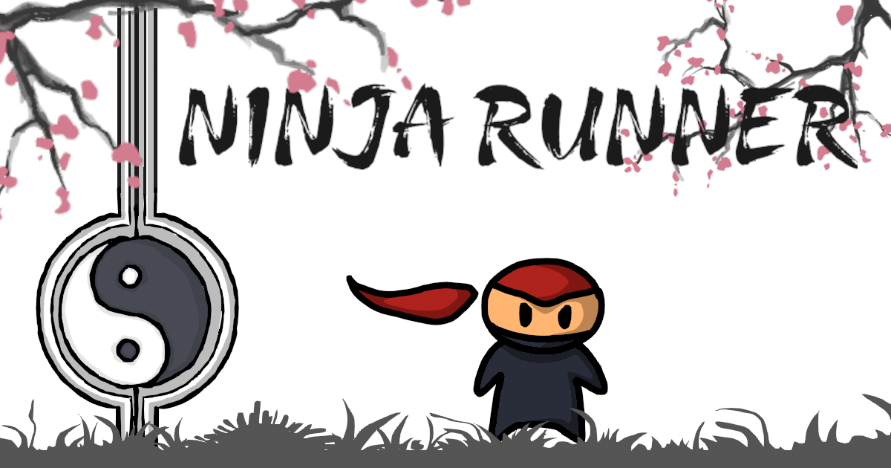

# Ninja Runner Game

 

> A fast-paced, 2D endless runner game built with pure JavaScript, HTML, and CSS. Dodge obstacles, collect power-ups, and share your high score in this challenging ninja adventure! All art, animations, and sound were created from scratch.

## 🎮 Play the Live Demo!

**[Click here to play Ninja Runner!](https://maxedoutpotato.github.io/NinjaRunnerGame/)**

---

## ✨ Features

* 🏃 **Endless Runner Gameplay:** The action gets faster and more challenging over time.
* 🥷 **Fluid Animations:** All character and effect animations were hand-drawn.
* ☀️/**🌙** **Dynamic Day/Night Cycles:** The world inverts at score milestones for an extra challenge.
* ✨ **Power-ups & Collectibles:** Grab teleport scrolls and bonus food to boost your score.
* 🐦 **Social Sharing:** Integrated share menu to post your high score on social media.
* 📱 **Responsive Design:** Fully playable on both desktop and mobile devices.

---

## ⌨️ How to Play

| Action | Desktop Controls      | Mobile Controls |
| :------- | :---------------------- | :-------------- |
| **Jump** | `Spacebar` / `Arrow Up` | `Single Tap`    |
| **Crouch** | `S` / `Arrow Down`      | `Tap and Hold`  |

---

## 🛠️ Tech Stack & Tools

This project was built from the ground up to practice and showcase a full range of game development skills.

#### **Code & Development**
* **Languages:** HTML5, CSS3, JavaScript (ES6)
* **Editor:** Visual Studio Code

#### **Art, Animation & Sound**
* **Graphics & Animation:** Gimp 2.0, Photoshop, Blender 4.0
* **Sound Effects & Music:** Magix Samplitude X6 Pro
* **Video & Promo GIFs:** Sony Vegas Pro 13

---

## 📝 Project Narrative

This game was developed as a personal project to deepen my understanding of web-based game development. My primary goal was to handle the entire creative pipeline myself, from the initial concept sketches to the final line of code. Every visual and audio asset in this game—including character sprites, animations, backgrounds, and music—was created by me. Some of the sound effects are from the internet . It was a fantastic challenge for art, animation, and coding.

---

## 👤 Contact

Created by **Sergei Vesselov**

* **Portfolio:** [your-portfolio-website.com](https://your-portfolio-website.com) <!-- Add your portfolio link here -->
* **LinkedIn:** [linkedin.com/in/your-profile](https://linkedin.com/in/your-profile) <!-- Add your LinkedIn link here -->

---

## 📜 License

This project is open source and available under the [MIT License](LICENSE).
